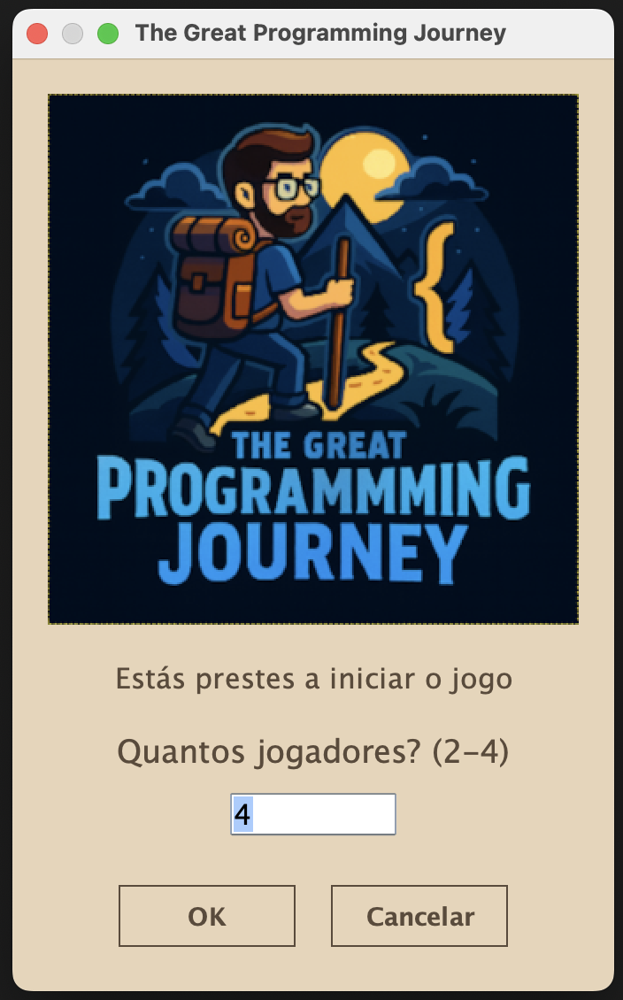
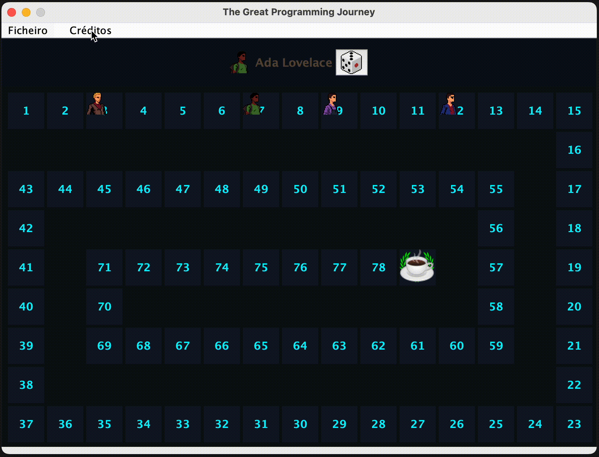
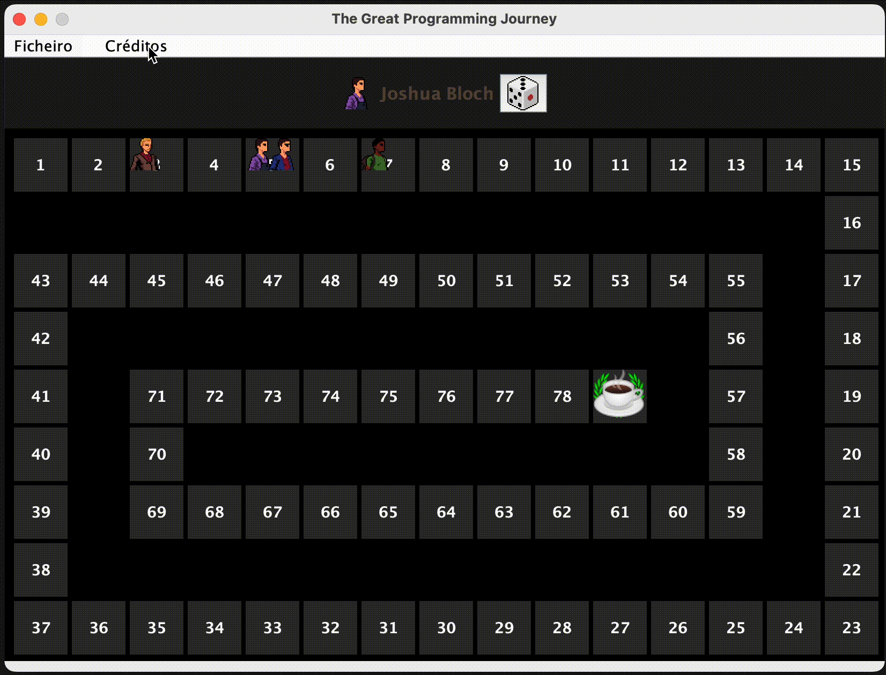
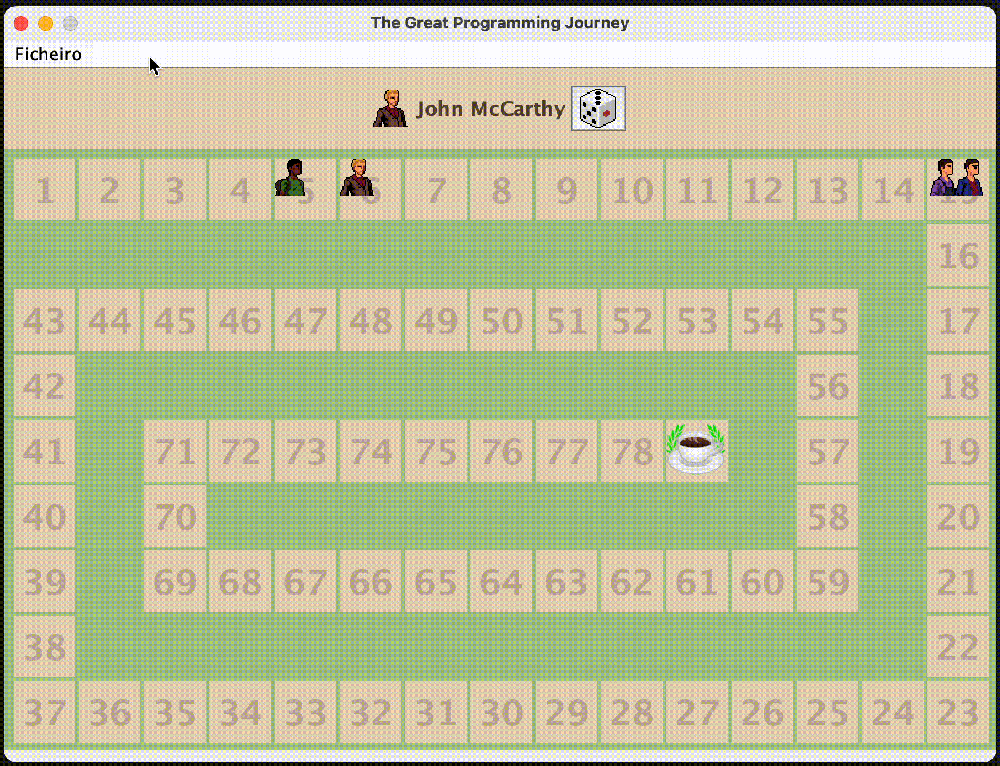
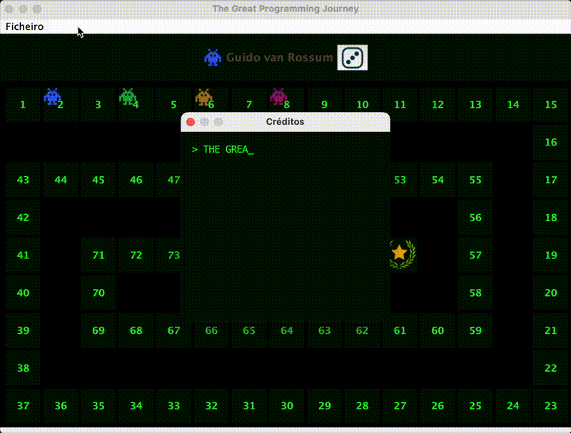
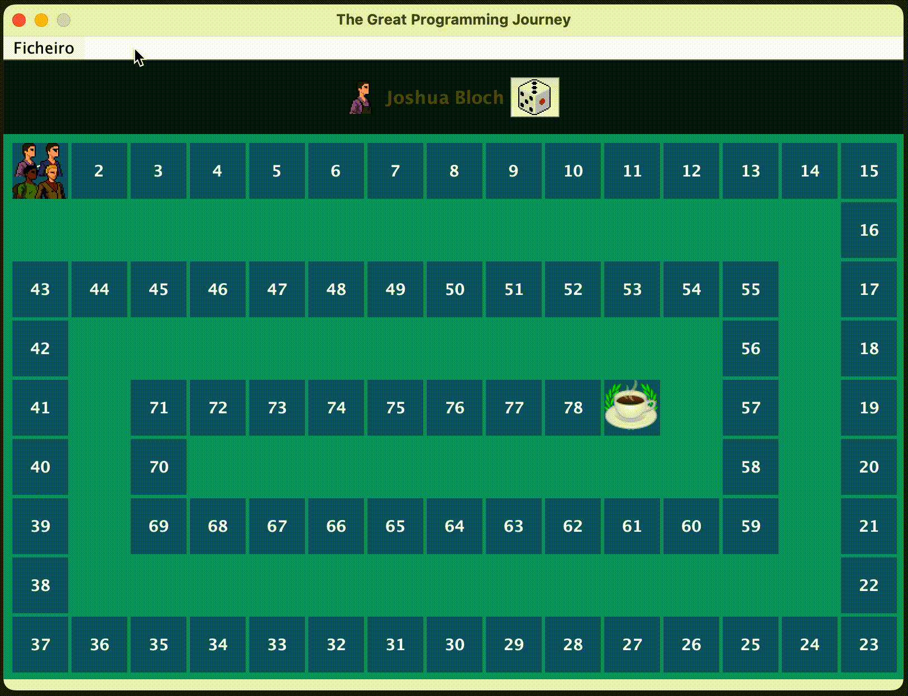
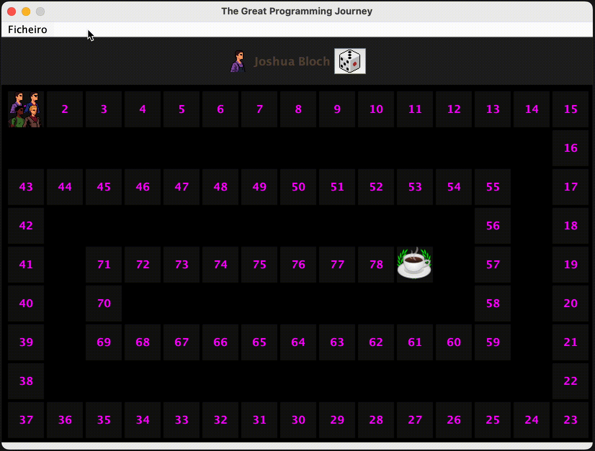
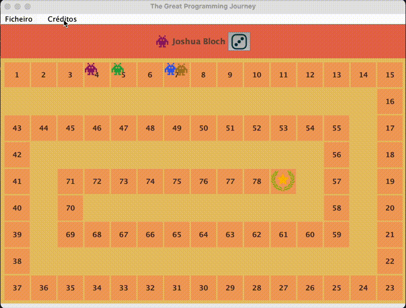
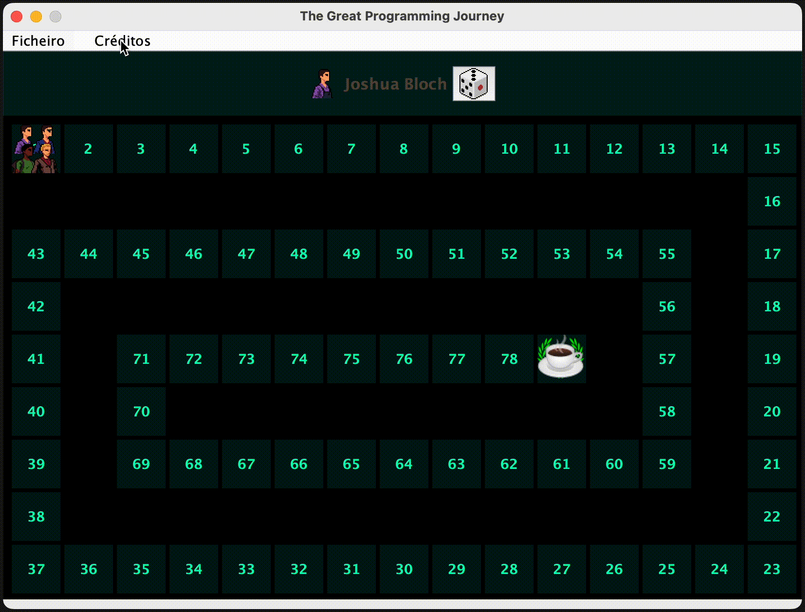
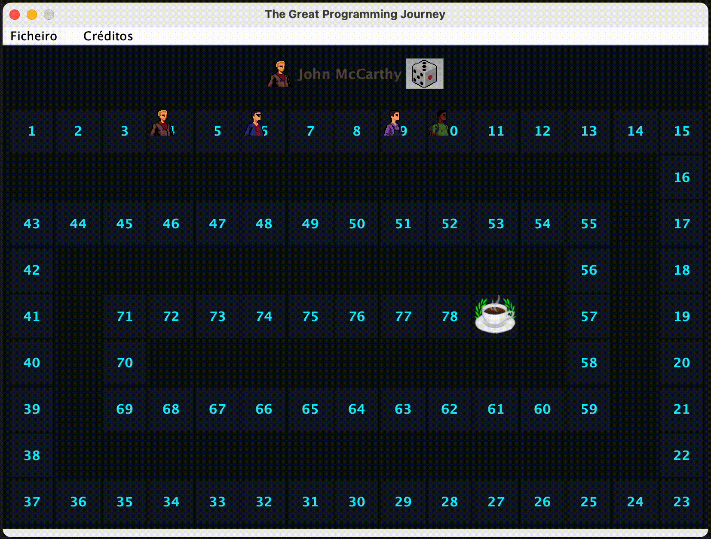

# Universidade Lusófona
## Licenciatura em Engenharia Informática
### Linguagens de Programação II
**Projeto:** The Great Programming Journey  
**Autor:** Ricardo Santos — nº 22409527  
**Ano letivo:** 2025/2026

## Índice
- [🧱 Diagrama UML Geral do Projeto](#-diagrama-uml-geral-do-projeto)
- [🎮 Estrutura do Projeto](#-estrutura-geral-do-projeto)
  - [🧩 Estrutura do Modelo de Jogo](#-estrutura-do-modelo-de-jogo)
    - [🗺️ Board](#️-board)
    - [🧱 Slot](#-slot)
    - [🧑‍💻 Player](#-player)
  - [🧭 Classes Utilitárias do Fluxo de Jogo](#-classes-utilitárias-do-fluxo-de-jogo)
    - [📦 Move e MoveHistory](#-modelmove--move--movehistory)
  - [🧠 Núcleo Lógico do Jogo (`core`)](#-núcleo-lógico-do-jogo-core)
    - [🧩 Core](#-classe-core)
    - [🔁 TurnManager](#-classe-turnmanager)
    - [🧩 GameManager](#-classe-gamemanager)
    - [⚙️ GameConfig](#️-gameconfig--ponto-único-de-configuração)
    - [📝 GameLogger](#-gamelogger--logging-consistente-e-legível)
  - [🎨 Sistema de Temas e Customização (`ui.theme`)](#-sistema-de-temas-uitheme)
    - [🖥️ Ecrã Inicial](#️-ecrã-inicial)
    - [🎨 Temas Disponíveis](#-temas-disponíveis)
    - [🎲 Atualização do Dado](#-atualização-do-dado)
- [🤖 Utilização de Modelos de Linguagem (LLMs)](#-utilização-de-modelos-de-linguagem-llms)

---

## 🧱 Diagrama UML Geral do Projeto

Diagrama UML com a representação das quatro classes principais do sistema: `Board`, `Slot`, `Player` e `Core (GameManager)`.  
Mostra as relações diretas entre os elementos centrais do modelo e a forma como se interligam para suportar o funcionamento do jogo.

📊 *Diagrama UML:*  


---

# 🎮 Estrutura Geral do Projeto

> Visão organizada dos principais módulos: **modelo do jogo**, **utilitários de fluxo**, **temas** e **núcleo lógico**.

---

## 🧩 Estrutura do Modelo de Jogo

### 🗺️ Board
**O que representa**  
Tabuleiro principal, composto por casas (`Slot`) que os jogadores ocupam.

**Porque da necessidade**  
Modela o estado físico do jogo: dimensão, posições e casa final. Sem o `Board`, a gestão espacial ficaria dispersa.

**Função no código**
- Cria casas (`Slot`);
- Posiciona e move jogadores;
- Expõe estado do tabuleiro (posições e jogadores).

**Limites de responsabilidade**
- Foca-se **apenas** na estrutura e estado do tabuleiro.
- Fluxo do jogo (turnos, ordem, progressão) vive noutras classes.
- É o **ponto de acesso** do package `model.board`; `Slot` é interno e não é acedido diretamente de fora.

---

### 🧱 Slot
**O que representa**  
Uma casa individual do tabuleiro, que armazena os jogadores presentes nessa posição.

**Porque da necessidade**  
Encapsula regras de ocupação e validação por casa, evitando poluição da lógica no `Board`.

**Função no código**
- Mantém lista de jogadores na casa;
- Verifica capacidade e duplicados (`isFull`, `hasPlayer`);
- Adiciona/remove com validação (`addPlayer`, `removePlayer`);

**Interação com o exterior**
- Apenas o `Board` interage com `Slot`.
- `Slot` é **totalmente encapsulado** dentro do package `model.board`.

**Limites de responsabilidade**
- Não decide movimentos, turnos ou vitória.
- Gera e gere **só** o conteúdo de uma casa.

---

### 🧑‍💻 Player
**O que representa**  
Entidade de jogador: `id`, `nome`, `linguagens`, `cor` associada e `estado`.

**Porque da necessidade**  
Permite distinguir participantes, manter estado e características por jogador.

**Função no código**
- Guarda dados fundamentais: `id`, `nome`, `linguagens`, `cor`, `estado`;
- Getters controlados e lista ordenada de linguagens (`getSortedLangs`);

**Limites de responsabilidade**
- Não trata de regras, movimento ou tabuleiro.
- **Não conhece a própria posição**: o `Board` controla e posiciona em `Slot`.

---

## 🧭 Classes Utilitárias do Fluxo de Jogo

### 📦 `model.move` — *Move* + *MoveHistory*
**O que representa**  
Registo cronológico das jogadas. `Move` descreve uma jogada; `MoveHistory` gere a coleção.

**Porque da necessidade**  
Persistir jogadas para análise, depuração, reconstrução, replay e contagem de turnos.

**Função no código**
- `Move` (imutável): `playerId`, `from`, `to`, `die`, `turn`;
- `MoveHistory`: cria/guarda `Move`, devolve contagem (`getSize`), faz reset, regista no log.

**Interação com o exterior**
- Interface externa é **exclusiva via `MoveHistory`**;
- `Move` fica **encapsulado** e invisível ao restante sistema.

**Limites de responsabilidade**
- Descritivo e passivo.
- Não decide turnos, nem altera estado do jogo.

---


## 🧠 Núcleo Lógico do Jogo (`core`)

### 🧩 Classe `Core`
**O que representa**  
Gestor central do jogo (o "real" *GameManager*). Orquestra tabuleiro, jogadores, regras, histórico e temas. Expõe a API pública usada pela UI.

**Porque da necessidade**  
Evita acoplamento entre módulos e centraliza o ciclo do jogo com validação consistente.

**Função no código**
- Inicializa tabuleiro e jogadores (`createInitialBoard`);
- Devolve id do jogador atual `currentPlayerId`;
- Executa jogadas (`moveCurrentPlayer`) e avança turnos;
- Validações com `InputValidator`/`GameRules`;
- Regista jogadas (`MoveHistory`);
- Verifica fim de jogo e vencedor (`gameIsOver`);
- Gera resultados (`getGameResults`);
- Integra temas (`ThemeLibrary`) e créditos (`getAuthorsPanel`).

**Integrações**
- `Board` para posições/movimento;
- `TurnManager` para ordem dos turnos;
- `MoveHistory` para histórico;
- `InputValidator`/`GameRules` para consistência;
- `ThemeLibrary`/`Credits` para UI.

**API pública**
- `createInitialBoard(String[][], int)`
- `getProgrammerInfo(int)` / `getProgrammerInfoAsStr(int)`
- `getSlotInfo(int)`
- `moveCurrentPlayer(int)`
- `getCurrentPlayerId()`
- `gameIsOver()`
- `getGameResults()`
- `getAuthorsPanel()`
- `customizeBoard()`

**Limites de responsabilidade**
- Não implementa regras nem desenha UI.
- Coordena fluxo e estado, delegando regras a `GameRules`, estado físico a `Board` e turnos a `TurnManager`.

---

### 🔁 Classe `TurnManager`
**O que representa**  
Utilitário sem estado para determinar **ordem e sequência** de jogadas.

**Porque da necessidade**  
Padroniza rotação de turnos (ascendente/descendente) e evita duplicação de lógica.

**Função no código**
- Primeiro jogador (`getFirstPlayerId`);
- Próximo jogador (`getNextPlayerId`);
- Suporta `TurnOrder` (`ASCENDING`, `DESCENDING`);

**Relação com `Core`**
- `Core` delega início e avanço de turnos ao `TurnManager`.
- `TurnManager` não conhece tabuleiro nem regras; apenas processa IDs/listas.

---

### 🧩 Classe `GameManager`

**O que representa**  
Interface de ligação entre o exterior (UI, testes, etc.) e o núcleo lógico (`Core`).  
Funciona apenas como *wrapper* para expor os métodos públicos de `Core`.

**Porque da necessidade**  
Os testes para o projeto esperam encontrar a classe `GameManager` diretamente na pasta `src`.  
Para manter uma arquitetura limpa, o verdadeiro gestor do jogo (`Core`) foi colocado no package lógico correto (`core`), 
ficando o `GameManager` na raiz apenas como ponto de acesso.

**Função no código**
- Instancia internamente um objeto `Core`;
- Redireciona todas as chamadas para esse objeto;
- Não implementa qualquer lógica própria.

---

### ⚙️ `GameConfig` — ponto único de configuração

**O que é**  
Classe imutável com constantes que definem regras, tamanho do mundo, ordem de turnos, tema e opções de logging.  
Tem construtor privado e só expõe `public static final`.

**Porque interessa**  
Permite escalar e alterar o comportamento sem tocar na lógica.  
Um único ficheiro controla validações, tabuleiro, UI e logs.

**Onde é usada**
- `GameRules` → limites de jogadores e dados, fórmula do tamanho mínimo do mundo (`BOARD_SIZE_MULTIPLIER`);
- `Board`/`Slot` → capacidade por casa (`SLOT_SIZE`), posição inicial, *bounce* no fim (`ENABLE_BOUNCE`);
- `Core` → ordem de turnos (`TURN_ORDER`);
- `ThemeLibrary`/`Credits` → tema ativo (`THEME`);
- `GameLogger` → cores ANSI e `DEBUG_MODE`.

**Principais alavancas**
- `MIN_PLAYERS` / `MAX_PLAYERS`, `MIN_DICE` / `MAX_DICE`
- `BOARD_SIZE_MULTIPLIER`, `SLOT_SIZE`, `BOARD_OFFSET`, `INITIAL_POSITION`
- `TURN_ORDER` (`ASCENDING` / `DESCENDING`)
- `ENABLE_BOUNCE` (chegar ao fim e “voltar para trás” ou parar na última casa)
- `THEME` (tema global)
- `DEBUG_MODE` + cores ANSI para logs

**Impacto prático**
- Mudar o equilíbrio do jogo altera-se em 1 sítio.
- Regras e validações ficam coerentes.
- Facilita testes e variantes sem *if*s espalhados.

**Exemplos rápidos**
- Desativar *bounce*:
  ```java
  public static final boolean ENABLE_BOUNCE = false;
  ```
- Forçar 6 jogadores:
  ```java
  public static final int MAX_PLAYERS = 6;
  ```
- Ordem inversa:
  ```java
  public static final TurnOrder TURN_ORDER = TurnOrder.DESCENDING;
  ```
- Trocar tema:
  ```java
  public static final ThemeType THEME = ThemeType.OCEAN;
  ```

---

### 📝 `GameLogger` — logging consistente e legível

**O que é**  
Logger leve para consola. Identifica a classe de origem e colore por nível usando `GameConfig`.

**Níveis suportados**
- `info(String msg)`
- `warn(String msg)`
- `error(String msg)`
- `error(String msg, Throwable t)` com *stack trace*

**Formato**
```
[INFO]  [Core] createInitialBoard: board created and initialized — starting game...
[WARN]  [TurnManager] getNextPlayerId: unsupported order type DESCENDING
[ERROR] [Board] createInitialBoard: startBoard() failed
```

Cores: `INFO_COLOR`, `WARNING_COLOR`, `ERROR_COLOR` e `RESET` vindas de `GameConfig`.

**Onde é usado**  
`Core`, `Board`, `Slot`, `TurnManager`, `MoveHistory`, `PlayerParser`, `PlayerColor`, `PlayerState`.  
Garante mensagens uniformes em todo o projeto.

**Porque interessa**
- Ajuda a depurar sem *breakpoints*;
- Destaca problemas reais (`error`) vs. situações não críticas (`warn`);
- Centraliza estilo e cores num único sítio (`GameConfig`).

**Ajustes típicos**
- Silenciar/estilizar por ambiente via `DEBUG_MODE` e cores em `GameConfig`;
- Padronizar mensagens de validação para leitura mais rápida nos testes.

---

## 🎨 Sistema de Temas (`ui.theme`)

### O que representa
Controla a aparência global do jogo — incluindo cores do tabuleiro, imagens dos jogadores e esquema visual da janela de créditos.  
Permite alterar completamente o ambiente gráfico sem modificar a lógica do jogo.

---

### Estrutura interna

**`Theme`**  
Unidade base de configuração visual. Define cores, espaçamentos, tamanhos e imagens.  
Expõe `getHashMap()` em HEX para uso uniforme pela interface.

**`ThemeLibrary`**  
Catálogo de temas pré-definidos (`ThemeType`).  
Converte valores HEX para `Color` e fornece utilitários:
- `getCreditsTextColor(type)`
- `getCreditsBorderColor(type)`
- `getCreditsBackgroundColor(type)`

> Cada tema define uma identidade visual distinta, afetando tabuleiro, jogadores e créditos.

---

### 🖥️ Ecrã Inicial

Novo **logótipo** adicionado, de acordo com o tema padrão **Night_Hacker**.  
Apresenta um visual mais moderno, noturno e ligado ao universo da programação.

📸 *Screenshot:*  



### 🎨 Temas Disponíveis


#### 🌑 NIGHT HACKER
Ambiente de programador noturno, inspirado em terminais e estética cyberpunk

📸 *Screenshot:*  


---

#### 🌑 DARK
Tema padrão escuro, focado em contraste e legibilidade.

📸 *Screenshot:*  


---

#### 🌕 LIGHT
Tema original, Claro, simples e limpo.

📸 *Screenshot:*  


---

#### 🕹️ RETRO
Estilo inspirado em terminais antigos — fundo verde e estética *vintage*.

📸 *Screenshot:*  


---

#### 🌊 OCEAN
Paleta fria com tons azulados, transmitindo leveza e serenidade.

📸 *Screenshot:*  


---

#### 💡 NEON
Visual vibrante com cores intensas e brilho contrastante.

📸 *Screenshot:*  


---

#### 🏜️ DESERT
Tons quentes e terrosos que remetem a paisagens desérticas.

📸 *Screenshot:*  


---

#### 🖥️ NEON TERMINAL
Mistura moderna do estilo *cyberpunk* com o visual clássico de terminais.  
Usa texto verde brilhante sobre fundo escuro.

📸 *Screenshot:*  


---

---

### 🎲 Atualização do Dado

As imagens do dado foram atualizadas.  
O novo dado apresenta um design mais moderno.

📸 *Animação do Dado:*  


---

## 🤖 Utilização de Modelos de Linguagem (LLMs)

Durante o desenvolvimento do projeto foi utilizado o **ChatGPT (OpenAI)** como ferramenta de apoio técnico e linguístico.

**Concretamente, o modelo foi utilizado para:**
- Reformular e melhorar a redação de mensagens de erro e registos de log, tornando-as mais claras e formais;
- Auxiliar na estruturação e revisão linguística deste documento (`README.md`), garantindo uma escrita mais coesa e correta;
- Apoiar na escolha de **paletas de cores** para os diferentes temas visuais;
- Sugerir **nomes e descrições** adequados para os temas criados.
