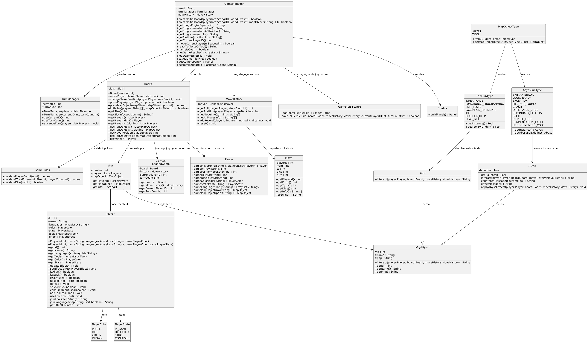
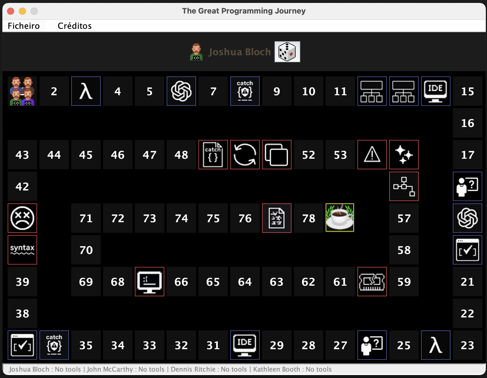

# The Great Programming Journey

Projeto desenvolvido no âmbito da unidade curricular de **Programação / Engenharia Informática** na **Universidade Lusófona**.

---

## 📐 Diagrama UML

O diagrama UML completo do sistema:


<!--//www.plantuml.com/plantuml/png/hLdlZjku4V_kfn3G3tLmksWBz9EHBavhoxkwsfOXoSq5XuF1bRXU9RAeajG6spOFrEVeYvN34UMHPRbfctnOapE_6SwVuP1KVbIQITqSoybBaNClAsHMyedwN5Gra-pePILJojTQ5a-Dvc4cggJu6_T-FvdyrllJfN_UF8g3owp9n6hp7jYHhrd53bnwVvzutksJO3BtPjuz_091Dx9oY9cNdcR0F8fN_bWeBUIROQvFCyFy8PES6JkhGXUijFgcTSdUk0ohPp5BZ1_LuPTVV_drnliYP9c3CxEYqk-CfYSXIiwg_qFBZNTaTVJqYMTQ4TIPyWFNuT4uiwqEqqecVssOx6n0eHQrbU9WSd34PQT5Jb6W-YBELuOz00-WokeS099IQCkfXJBUYsfapNaZ9Q_q5gEoi8eC4hYGdnuRlAnPnjM5I4lECfqA_-bDgKYcXd5k4ploK4MlHiqmZb19CLTDgPNb-bAojrMXz7jKS0UuKh0SWDFdekIpfVa3q5THvC1Lx9KFkVrb_4Q_2AcshE9etazs2DoiKLeSJVwnIe3voDJBcjMj2JVEag-q_EEcvCeM_m-lh2nofZd6QYwQIa-hOQGwt0TNSTEpsgjF2gw8BugCJwKeotECiuzkDzoU6IOpNBWSumQrAvtIJiJQpQ9cDXNesDsxSr2d5irtAj7uVfcH0aDwwi2Kpl9NLcKSU9SjS6d_EjwzxYC_NbnlNpRJ61bL2gsWNCqlRWqi0tOaZk2EG1jQksOuk_6KvhK2774ZUs7LeSLlsrruBbVnBuO5WhIM3IWRMOXkPvfr9xLsZMjwTADPHxFY5oGBR91GYxWSxNhVt0njBTFqVdiNGkzmxzDCKpRjXKZe2_jw2ca4o8YQBWvaeOus19qfx1Wjy5fYQHI8IWU-b9k-o8UYgep7nDTkMqDCiMghvlZ4vMapjxaREd_RhJVgnsZiJmLr8GYON9hGQtjoxM-zwFwdO9ucOpkJFIajcR4JVNNBeSE_AN9q5iOLE_9kNI3KrQ5tu1WS1rNdEyXUKcPsVzzuv0uo8pUGmN4QvcULlO6ZPW23gm0XVXquPCz7T2Q3rcBJ1wUbwvD812L8_gwEj4loVCsLOWS-RGapMAeFvS_F9kmEr-UnkYxVh2U1HQd_qJBiTyCWWJKGe-_c-fMQtAxyZq5y_Q30LN7FaHAyFI_1sv9LXyR4IurSOMupKGhPxUavp82iDDEy8oSm0x8sSL3jHIJX-Zt4nQh1v7G2c0M8LwzHtdXWODkoRxpEkDd0j1lF6ZOZPhtxlkfkFElZZ7Zuxh_RMYkttkW54L0GedC4q1pV6cFvD0N8irOHdfq3hwbpCtArthjqSetaAQPaHXD2WONoo-ALqwilaXFTP9-7vBcedXl5ytFE2rFsRWsbuNOjvUVycJFTjz6kOF_EMYHbPsubDxW4Oda-NDOnZT0uyvCeAaoAudLRF3ItY739fIXJCa9gQWsj1umxxPTGGLTFd-WlWVSO9caKVxo-tw69u6vl7ujappzBSJpDj3YDyoBZ_Okrcv5ZTb3iIwFlmftuZ6Gl-qWQFNc1hWNE2EDqSI2z4Rs3nectXUepp-rU0OpRAx4eoultt7kMVQPtNOIFN76lYS1grW-8riZLq2zBWAc1luXWUHxpJ9mUzcslWZpXI0lyXVoSNxGbLvpibcldH10dfdQ2pVmRFefikLI5yRlAi8xiqnKo3S_I_WDrPJWy1o7tY4r57_LjfvtfkVIfFdYCZRqIYG7U-_VIXlBkRkHppil8rvhR_jfNtvUGK_V6TggHIdHQ7fbV-rWn_fQycay_JlxZkS-auX8pMCFOdOVquz6DD_P4nM4d71h39FlI2XBJBVUqUuGoY16KyRd8nzcsJK2TZqFm0CJp6H73mn2HU1mg-3j0Mbw7F7NlqeoKGuyTqo13tgdzc7Jq2qWp9KzGYhwQwbruFSrpoVD2AyppKrEK-U03qHNjmMQt7dtEyAevqk3QDRQxUBiApE1-jOEVXpW8DZ2DemyRM0gaQA2jLBZPF_Xhm2-2PU2dmS8CatGt_xFvdKURvIun92VT1IPzgr7Ul_-O9EOtZQ8LE0eDCboGDtLFPF3uquRecefgdb8x7OXswyEHdrYOi_unYCFKtyp1W-LkCq_3QEElzjiuUeZzzJhSF1Z6RXEc-pH8Kh0q-7aUR06sV_GtYnKYmWKeI0D_RXJk7uFL5jn_zDFzmpRjZaQbMOKd9drSmV3-ZJYDN6SqFiwerSd7JUh_l0_YE8hDT1KzX7ESKVF0eN0Lx3THkbz6kyq2B8hzv15ojTkkmZbaQp-FhEb9O9AryEEF-s2vXASmP3w95ZP8oz048DYlecXheG_hm5XWOx3qTojmqEYFvZkWEvr3fz6Jbc77r6t7lrRLSR2oouvMDZvaRs__SNVAlb7ymcNE9lO1DyQSz0hDeEvwWJSuoPKeN_a582WUuYQEJ666d_DNu7i5XgPWXZ8XQv75nz0J-dySWBvlpyHCL5gAaWq0QU-_FCnVRWzXeOp8SO0cPvnrw636pFia3Ynd5oK6zmjZ2fD6aFtkq1ZJhF38OgxHpRoZK5gQLC2t9Cl2RcCujSYDmMR8zB_-wVtH8KWYAUWFama6111uN1gs4SnaOJm0AxoSvSQUd1Daz-NSWF5xjebwtMZ04vXTUmR4Ma1OQY49brnSN0pGUGy3aGkhRa93x49-qYf0grSQFkOR0m50shSDNlCZPTBsZCmVUPKtn_BV -->

---

## 🎥 Vídeo de Demonstração

Demonstração do jogo a correr, incluindo:
- Jogo completo
- novo abismo **Undocumented Code** e a ferramenta **ChatGPT**

👉 **Vídeo demo:**  
https://youtu.be/m6JotbGwSIY
---

## 🕳️ Novo Abismo: Undocumented Code

### Conceito
Representa um projeto sem documentação, causando confusão ao programador.

### Comportamento
Quando um jogador cai neste abismo:

1. **Se tiver a ferramenta que o anula diretamente**
   - O abismo é anulado
   - A ferramenta é consumida
   - Nenhum efeito negativo é aplicado

2. **Se NÃO tiver a ferramenta de anulação**
   - O jogador fica no estado **CONFUSED**
   - Fica impedido de jogar durante **N turnos**
   - Onde:
     ```
     N = max(1, último valor do dado / 2)
     ```

3. **Nos turnos seguintes**
   - Quando o contador chega a zero, o jogador volta ao estado normal

### Mensagem apresentada
```
Projeto não documentado! O programador está confuso e precisa de alguns turnos....
```

---

## 🛠️ Nova Ferramenta: ChatGPT

### Conceito
Ferramenta especial que pode ajudar a lidar com problemas inesperados.

### Comportamento geral
- Ao cair numa casa com a ferramenta, o jogador **adquire o ChatGPT**
- A ferramenta é guardada no inventário do jogador

### Interação com Abismos

#### 1️⃣ Abismo Undocumented Code
- O **ChatGPT pode anulá-lo**
- Se for usado:
  - É **sempre consumido**
  - O jogador **não fica confuso**

#### 2️⃣ Outros abismos que tenham counter
- O ChatGPT tem uma **probabilidade de 50%** de anular qualquer abismo que tenha counter
- A decisão é **aleatória**
- **Mesmo que não anule**, o ChatGPT é sempre consumido

### Resumo do ChatGPT
- Pode anular vários tipos de abismos
- Introduz incerteza no jogo
- É sempre consumido quando usado
- Aumenta o fator estratégico

---

## Personalização do tabuleiro

Personalização definida através do método `customizeBoard()` do `GameManager`:



---

**Ricardo Santos**  
Engenharia Informática  
Universidade Lusófona  
Ano letivo 2025/2026
